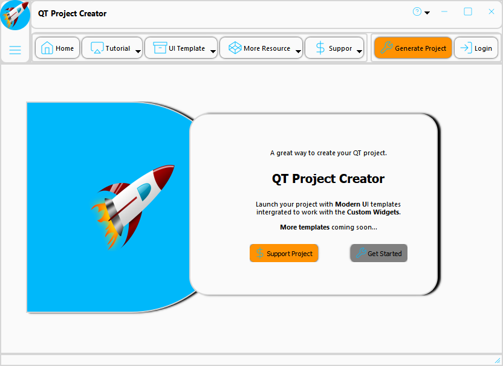
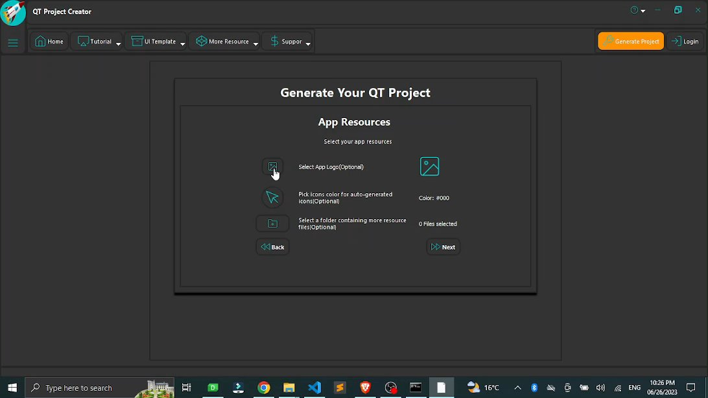

# Qt-Project-Creater-Modern-GUI
Join our ongoing project! Create and share modern GUI projects in QT effortlessly. Enjoy stunning Animated GUI with Custom Widgets and essential functionality. We're here to support you. Let's make QT development a breeze!

# Overview
The Qt-Project-Creater-Modern-GUI is an ongoing project aimed at creating a desktop app using QT (PySide). Our goal is to provide a platform that empowers QT developers to effortlessly create and share modern GUI projects.

# Features
- Modern Animated GUI: Elevate the aesthetics and functionality of your QT projects with a visually stunning and dynamic GUI using our Custom Widgets module.
- Essential Functionality: Gain access to a comprehensive set of essential functions designed to simplify your QT development process and help you navigate QT's features effortlessly.
- Seamless Sharing: Easily package and share your projects with the community, fostering collaboration and inspiring others in the creation of remarkable GUI projects.
  
# Documentation
Detailed documentation, including guides and tutorials, is provided to assist you in utilizing the app effectively. If you have any questions or need support, our responsive team is here to help.

# Getting Started
- Clone this repository to your local machine.
- Follow the installation instructions provided in the documentation.
- Start exploring the app's features and unleash your creativity in creating modern GUI projects with QT.
  
# Contributing
We welcome contributions from the open-source community. If you have any ideas, bug fixes, or enhancements, please submit a pull request.

# License
This project is licensed under the MIT license. See the LICENSE file for more details.

# Contact
For any inquiries or feedback, please reach out to Spinn at spinncompany@gmail.com.

We appreciate your interest and look forward to your involvement in making the Project a success!

Happy coding!

